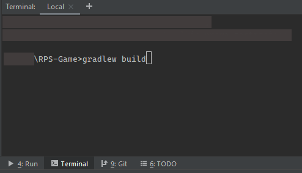

# Simple console game (Rock-Paper-Scissors)

## Instructions

 1. Download project.
 2. Open (for example) **IntelliJ** and import downloaded directory with all files.
 3. Go to the **CLI** (IntelliJ), type *gradlew build* (screen below) and then press Enter.

 4. After that open RpsRun.java and run it.
 5. Rest of instructions are in the running program
 6. Enjoy!

## Others
Created using:
Java version 1.8.0_251 (build 1.8.0_251-b08)

